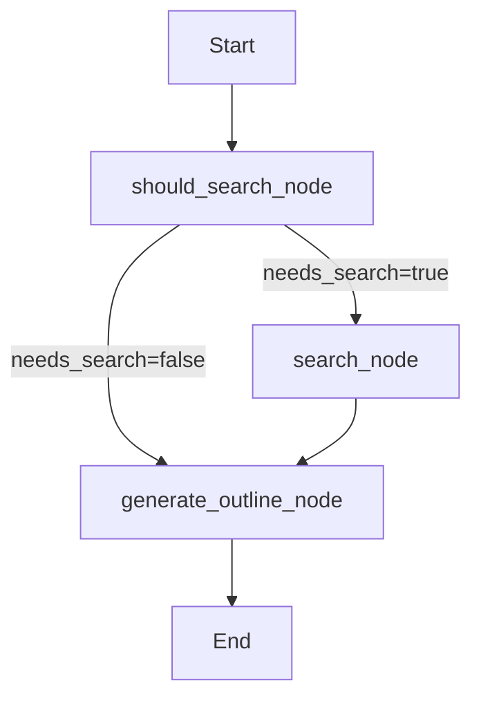

# LangGraph Outline Generation

## Overview

The outline generation now uses **LangGraph** with autonomous web search capability. The LLM intelligently decides when to search for factual information before creating video outlines.

## Features

- 🤖 **Autonomous Search Decision** - LLM analyzes if the topic needs current information
- 🔍 **Smart Search Queries** - Generates 1-3 specific, relevant search queries  
- 🌐 **SearXNG Integration** - Uses existing self-hosted search engine
- 🔄 **Backward Compatible** - Can disable LangGraph with `--no-langgraph`
- ✅ **Works with Ollama & OpenAI** - Unified interface

## Quick Start

### Enable LangGraph (Default)
```bash
uv run python script-writer.py \
  --topic "New features in Python 3.13" \
  --model gpt-oss
```

The agent will:
1. Analyze if search is needed
2. If yes: Search SearXNG → Use results in outline
3. If no: Generate outline directly

### Disable LangGraph
```bash
uv run python script-writer.py \
  --topic "Introduction to variables" \
  --no-langgraph \
  --model gpt-oss
```

## When Search Is Triggered

Search is **ENABLED** for topics involving:
- Specific software versions/features (e.g., "Python 3.13 features")
- Current best practices (e.g., "Docker best practices 2024")
- Recent tools/technologies (e.g., "Latest AI frameworks")
- Technical specifications (e.g., "AWS Lambda limits")

Search is **DISABLED** for topics involving:
- General concepts (e.g., "What is a variable")
- Fundamental principles (e.g., "Object-oriented programming basics")  
- Timeless educational content

## Graph Architecture



**Nodes:**
- `should_search_node`: LLM decides if search needed
- `search_node`: Executes SearXNG searches
- `generate_outline_node`: Creates outline (with/without search context)

## Testing

```bash
# Run test suite
uv run python test_langgraph_outline.py
```

**Test Results:**
- ✅ Test 1 (search topic): Generated 7 sections with search
- ✅ Test 2 (general topic): Generated 9 sections without search

## Dependencies

- `langgraph>=0.0.20` (already installed)
- `langchain`, `langchain-community`
- SearXNG (optional, graceful fallback if not configured)

## Configuration

Set `SEARXNG_URL` in `.env`:
```bash
SEARXNG_URL=http://192.168.88.86:8888
```

If not configured, agent skips search and generates outline directly.

## Example Output

### With Search (Python 3.13 topic)
```
outline_agent.should_search - Decision: SEARCH
outline_agent.should_search - Search queries: 
  - Python 3.13 new features
  - Python 3.13 release notes
  - Python 3.13 feature list
outline_agent.search - Search completed. Total results: 1637 chars
outline_agent.generate_outline - ✓ Successfully generated outline with 7 sections
  Section 1: Hook
  Section 2: Release Highlights  
  Section 3: Free-Threaded Mode (GIL Disabled)
  ...
```

### Without Search (General topic)
```
outline_agent.should_search - Decision: NO SEARCH
outline_agent.generate_outline - ✓ Successfully generated outline with 9 sections
  Section 1: Hook
  Section 2: What Is a Variable
  Section 3: Types of Variables
  ...
```

## Troubleshooting

**Issue:** LangGraph not working
```bash
# Reinstall dependency
uv add langgraph
```

**Issue:** Search not working
```bash
# Check SearXNG URL
echo $SEARXNG_URL

# Test SearXNG connection
uv run python test_searxng.py
```

**Issue:** Want old behavior
```bash
# Use --no-langgraph flag
uv run python script-writer.py --no-langgraph --topic "..."
```

## Implementation Details

See:
- [Implementation Plan](file:///home/user/.gemini/antigravity/brain/ffd95232-d2aa-4a24-acc1-e8e3ea433a9d/implementation_plan.md)
- [Walkthrough](file:///home/user/.gemini/antigravity/brain/ffd95232-d2aa-4a24-acc1-e8e3ea433a9d/walkthrough.md)
- [Task Checklist](file:///home/user/.gemini/antigravity/brain/ffd95232-d2aa-4a24-acc1-e8e3ea433a9d/task.md)
